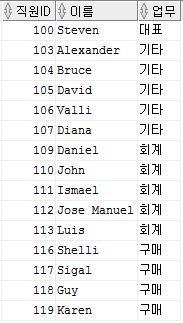
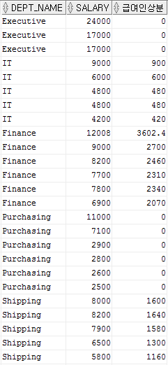
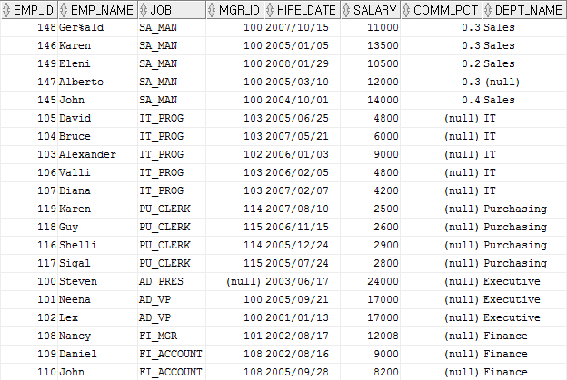
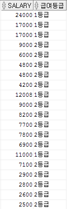
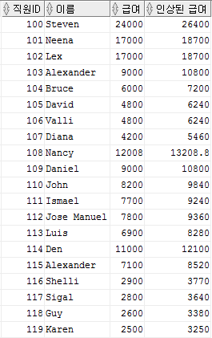
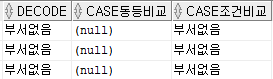

### DECODE
- decode(컬럼, 비교1, 출력1, 비교2, 출력2, ... , 비교n, 출력n, 출력)  
"컬럼"의 값을 "비교1"과 같으면 "출력1"을 반환, "비교2"와 같으면 "출력2"를 반환, ... ,  
"비교n"과 같으면 "출력n"을 반환, 아무것도 같은 것이 없으면 "출력"을 반환  
- decode는 가상의 컬럼을 만드는 것인데, 컬럼의 데이터 타입이 정해져 있지 않다.  
따라서 decode 컬럼의 데이터 타입은 "출력1"의 데이터 타입으로 정해진다.  
       - 만약 decode(A, 0, A, "없음") - A는 컬럼의 이름  
       이렇게 되면 "출력1"이 100으로 숫자형이므로 decode의 데이터 타입도 숫자형이 된다.  
       데이터가 비교인 0과 같으면 100이 출력되고, 데이터가 비교인 0이 아니면 "없음"이 출력 되야한다.  
       그런데 "없음"의 데이터 타입은 문자형으로 decode의 데이터 타입과 맞지 않으므로 에러가 발생한다.  
       => decode(A, 0, to_char(A), "없음")  
       => 이렇게 하면 첫 번째 출력1인 to_char(A)가 문자형이고, "없음"도 문자형이므로 에러가 나지 않는다.

****

- EMP 테이블에서 업무(job)이 'AD_PRES'거나 'FI_ACCOUNT'거나 'PU_CLERK'인 직원들의 ID(emp_id), 이름(emp_name), 업무(job)을 조회  
업무(job)가 'AD_PRES'는 '대표', 'FI_ACCOUNT'는 '회계', 'PU_CLERK'의 경우 '구매'가 출력되도록 조회

```sql
select emp_id 직원ID, emp_name 이름,
       decode(job, 'AD_PRES', '대표',
                   'FI_ACCOUNT', '회계', 
                   'PU_CLERK', '구매', '기타') 업무
from emp
where job in ('AD_PRES', 'FI_ACCOUNT', 'PU_CLERK', 'IT_PROG');
```

###### 결과



- EMP 테이블에서 부서이름(dept_name)과 급여 인상분을 조회  
급여 인상분은 부서이름이 'IT' 이면 급여(salary)에 10%를 'Shipping' 이면 급여(salary)의 20%를 'Finance'이면 30%를 나머지는 0을 출력

```sql
select dept_name, salary,
       decode(dept_name, 'IT', salary * 0.1,
                         'Shipping', salary * 0.2,
                         'Finance', salary * 0.3, 0) 급여인상분
from emp;
```

###### 결과



- 직원들의 모든 정보를 조회  
단 정렬은 업무(job)가 'SA_MAN', 'IT_PROG', 'PU_CLERK' 순서대로 먼저나오도록 한다. (나머지 JOB은 상관없음)

```sql
select *
from emp
order by decode(job, 'SA_MAN', 1,
                     'IT_PROG', 2,
                     'PU_CLERK', 3, 9999);
```

###### 결과



****

### CASE

1. 동등비교
- case 컬럼 when 비교1 then 출력1 when 비교2 then 출력2 ... when 비교n then 출력n else 출력 end  
"컬럼"의 값이 "비교1"과 같으면 "출력1"을 반환, "비교2"와 같으면 "출력2"를 반환, ...,  
"비교n"과 같으면 "출력n"을 반환, 모든 비교와 같지 않으면 else의 "출력"을 반환

****

- EMP 테이블에서 업무(job)이 'AD_PRES'거나 'FI_ACCOUNT'거나 'PU_CLERK'인 직원들의 ID(emp_id), 이름(emp_name), 업무(job)을 조회  
업무(job)가 'AD_PRES'는 '대표', 'FI_ACCOUNT'는 '회계', 'PU_CLERK'의 경우 '구매'가 출력되도록 조회

```sql
select emp_id 직원ID, emp_name 이름,
       case job when 'AD_PRES' then '대표'
                when 'FI_ACCOUNT' then '회계'
                when 'PU_CLERK' then '구매'
                else '기타'
       end 업무
from emp
where job in ('AD_PRES', 'FI_ACCOUNT', 'PU_CLERK', 'IT_PROG');
```

###### 결과


- EMP 테이블에서 부서이름(dept_name)과 급여 인상분을 조회  
급여 인상분은 부서이름이 'IT' 이면 급여(salary)에 10%를 'Shipping' 이면 급여(salary)의 20%를 'Finance'이면 30%를 나머지는 0을 출력

```sql
select dept_name, salary,
       case dept_name when 'IT' then salary * 0.1
                      when 'Shipping' then salary * 0.2
                      when 'Finance' then salary * 0.3
                      else 0
       end as 급여인상분
from emp;
```

###### 결과


****

2. 조건비교
- case when 조건1 then 출력1 when 조건2 then 출력2 ... when 조건n then 출력n else 출력 end  
"조건1"을 만족하면 "출력1"을 반환, "조건2"를 만족하면 "출력2"를 반환, ...,  
"조건n"을 만족하면 "출력n"을 반환, 모든 조건을 만족하지 않으면 else의 "출력"을 반환

****

- EMP테이블에서 급여와 급여의 등급을 조회하는데 급여 등급은 10000이상이면 '1등급', 10000미만이면 '2등급' 으로 나오도록 조회

```sql
select salary,
       case when salary >= 10000 then '1등급'
            else '2등급'
       end "급여등급"
from emp;
```

###### 결과



- EMP 테이블에서 직원의 ID(emp_id), 이름(emp_name), 급여(salary), 인상된 급여를 조회  
단 급여 인상율은 급여가 5000 미만은 30%, 5000이상 10000 미만는 20% 10000 이상은 10% 로 한다.

```sql
select emp_id 직원ID, emp_name 이름, salary 급여,
       case when salary < 5000 then salary * 1.3
            when salary between 5000 and 9999 then salary * 1.2
            else salary * 1.1
       end as "인상된 급여"
from emp;
```

###### 결과



****

### null조건에서의 decode, case동등비교, case조건비교 차이
- 값과 null을 비교할 때, ( 값 = null ) 이렇게 비교하면 안되고 ( 값 is null )로 비교해야 한다. 
- decode는 비교하는 값이 null일 경우 =(이퀄) 연산이 아니라 is 연산으로 처리해준다.
- case동등비교는 항상 =(이퀄) 연산을 진행한다. => null을 인식하지 못 한다.  
case조건비교는 조건 부분에 is 연산을 사용하면 된다.

****

- 예제

```sql
select decode(dept_name, null, '부서없음') decode,
       case dept_name when null then '부서없음' end case동등비교,
       case when dept_name is null then '부서없음' end case조건비교
from emp
where dept_name is null;
```

###### 결과



****
